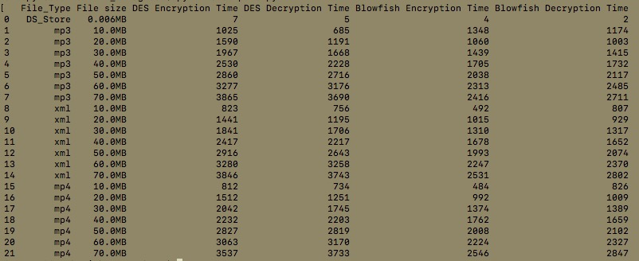

1. Got Blowfish python implementation from https://github.com/vnn/OpenBSD/blob/master/bfcrypt.py

    Install pycryptodome for Crypto module to work for Blowfish
    Still didn't work, works in python 2. So, proceeding with that.

    Here, the key is not automatically generated, so hardcoded "This is the key .."

2. Found Java implementation of DES but has a key generator from https://www.journaldev.com/1309/java-des-algorithm-program
    Disabled decryption 
    Added Code for convenient command line arguments

3. Found JAVA implementation of Blowfish.
    Enabled encryption and decryption commands in both DES and Blowfish codes
4. Made dummy files with
        mkfile <size> <filaname>
        eg. mkfile 10M 001.xml
    
5.Output of compare.py
 
